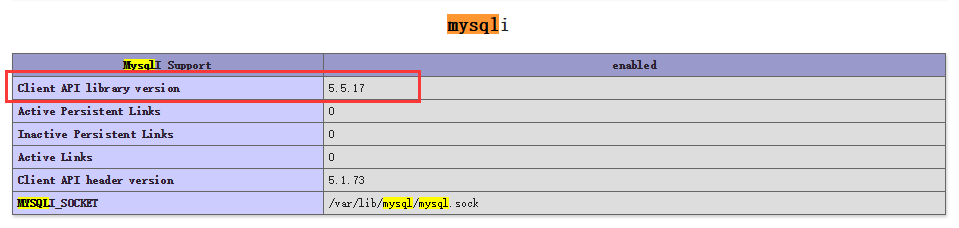
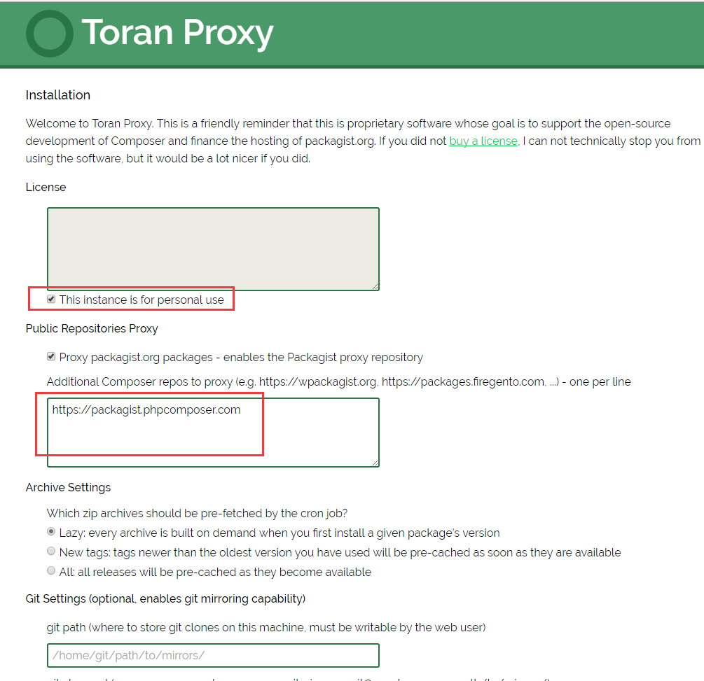

# 搭建Composer私有仓库

## 搭建方式：

1. Toran Proxy
2. Satis 
3. Packagist （基于Toran Proxy，需要php-mysql扩展的Client API library version >= 5.5）



> 这里推荐使用Toran Proxy，安装简单，不需要使用数据库，使用也比较方便

## 搭建 Toran Proxy 环境

下载地址：https://toranproxy.com/download

- 下载最新安装包并解压
- 复制一份文件 `app/config/parameters.yml.dist` 为 `app/config/parameters.yml`
- 修改 `app/config/parameters.yml` 中的 `secret` `toran_host`然后保存
    ```
    parameters:
        # this secret should be changed to something unique and random if possible
        secret:         base64:jRenU3utZvPBaWxBvqRAEQGbq0KP8vWEJayH6UI14sQ=
    
        # http or https depending on your hosting setup
        toran_scheme:   http
    
        # in case you use non-standard ports you can update them here
        toran_http_port: 80
        toran_https_port: 443
    
        # the hostname toran is hosted at
        toran_host:     packagist.dev
    
        # e.g. /foo if toran is hosted in a sub-directory, or leave it empty if it is on its own domain, no trailing slash!
        toran_base_url:
    
        # in you run Toran Proxy in a virtual machine and have issues saving due to CSRF token,
        # this is because sessions can not be written. In which case you can uncomment the line
        # below and configure the sessions to be written somewhere else like /tmp
        #session_save_path: /tmp/sessions
    ```


- 修改nginx或httpd配置，已nginx为例
    ```
    server {
        listen       80;
        server_name  packagist.dev;
    
        location / {
            root   /var/www/html/toran/web;
            index  index.html index.htm app.php;
    
            try_files $uri $uri/ /app.php$is_args$args;
        }
    
        location ~ \.php(.*)$ {
            proxy_buffer_size       128k;
            proxy_buffers           32 32k;
            proxy_busy_buffers_size 128k;
            proxy_set_header        Host $host;
            proxy_set_header        X-Real-IP $remote_addr;
            proxy_set_header        X-Forwarded-For $proxy_add_x_forwarded_for;
            proxy_pass              http://127.0.0.1:10001$request_uri;
        }
    }
    ```


- 修改服务器HOST文件
    ```
    127.0.0.1    packagist.dev
    ```


- 添加 SSH密钥
  根据nginx当前的用户(`apache`为例)添加，否则git://开头地址将无法发布私有包
    ```
    ssh-keygen -t rsa -C "mail@wangdong.io"
    cp -r ~/.ssh /home/apache/
    ```


- 访问 http://packagist.dev 并填写下图中2处配置信息
    
    
- 修改项目中的`composer.json`文件
  ```
  {
      "config": {
        "secure-http": false
      },
      "repositories": [
        {
          "type": "composer",
          "url": "http://packagist.dev/repo/private/"
        }
      ]
  }
  ```
  
  **修改本地HOST**
  ```
  127.0.0.1    packagist.dev
  ```
